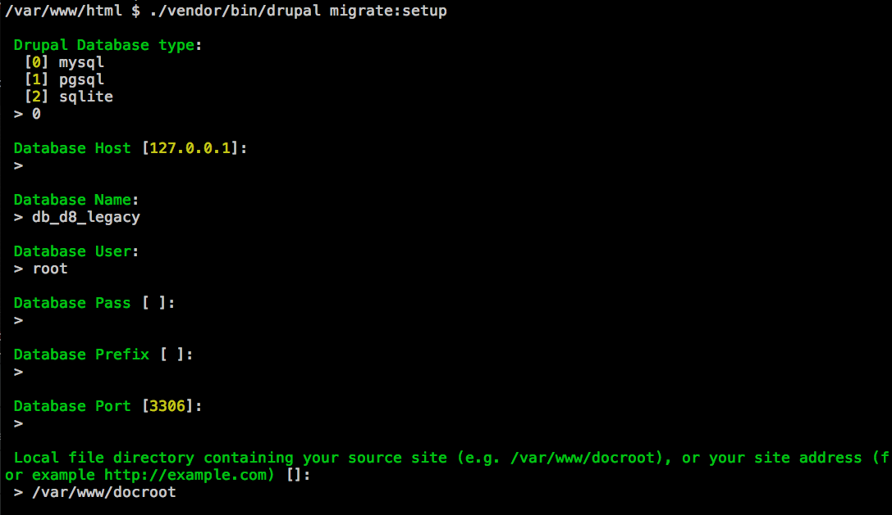

# drupal8-migration-terms

Module to migrate Drupal 8 terms to Drupal 8
This module migrates terms from Tags vocabulary.

Instructions:
-------------

- Install [DrupalConsole](https://docs.drupalconsole.com/en/getting/project.html)
 if you do not have it yet:

- Enable custom module

`$ drupal module:install drupal8_migration_terms`

- Setup migration

`$ drupal migrate:setup`

Inline-style: 

Reference-style:
![alt text][logo]

[logo]: https://github.com/adam-p/markdown-here/raw/master/src/common/images/icon48.png "Logo Title Text 2"

- Execute migration

`$ drupal migrate:execute migration_term_tags`